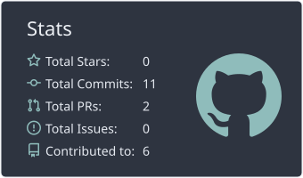
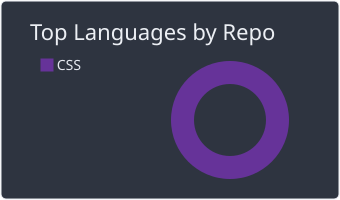
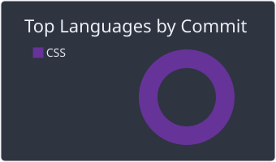

<div align="center">


<br>


<br><br>
### 👋 Hi, I'm Amir!

**Software Engineer** specializing in **backend infrastructure, full-stack web development, and DevOps automation.**

<br>

<p align="center">
  <a href="https://www.linkedin.com/in/amir-taqiyeddine-allag-718983434/">
    
  </a>
  &nbsp;&nbsp;
  <a href="https://www.instagram.com/a_m0_i_r/">
    
  </a>
  &nbsp;&nbsp;
  <a href="mailto:amirtaqiyeddineallag@gmail.com">
    
  </a>
  &nbsp;&nbsp;
  <a href="https://github.com/amir0l0">
    
  </a>
</p>
<br>


</div>

---


```java
// amir0l0 — tools_I_use organized

class AboutMe {
    String role = "Software Engineer";

    String[] focus = {
        "Backend Infrastructure",
        "Full-Stack Web Development",
        "DevOps Automation"
    };

    String[] backend = {
        "Java", "Spring"
    };

    String[] frontend = {
        "TypeScript", "JavaScript", "Next.js",
        "HTML", "CSS", "Tailwind CSS", "Three.js"
    };

    String[] devops = {
        "Docker", "Kubernetes", "Jenkins", "Nginx"
    };

    String[] tools = {
        "Git", "GitHub", "Figma"
    };

    String[] platforms = {
        "Linux", "Ubuntu"
    };
}
```

- 🛠️ Building backend services with **Java + Spring**.
- 🌐 Working across **TypeScript, JavaScript, Next.js, HTML, CSS, Tailwind CSS, and Three.js**.
- 🐳 Using **Docker, Kubernetes, Jenkins, and Nginx** for infrastructure and automation.
- 🐧 Comfortable in **Linux and Ubuntu** environments.
- 🔍 Interested in clean architecture, practical DevOps, and production-ready systems.

---

## 📊 GitHub Stats

<div align="center">
  <a href="https://github.com/amir0l0">
    
    
    
  </a>
</div>

---

## 🐍 Contribution Activity

<div align="center">
  <picture>
    <source media="(prefers-color-scheme: dark)" srcset="https://raw.githubusercontent.com/amir0l0/amir0l0/output/github-contribution-grid-snake-dark.svg" />
    <source media="(prefers-color-scheme: light)" srcset="https://raw.githubusercontent.com/amir0l0/amir0l0/output/github-contribution-grid-snake.svg" />
    
  </picture>
</div>

---

## 💻 Code Cycle

<div align="center">

😵‍💫 &nbsp;&nbsp;&nbsp;&nbsp; 🙂 &nbsp;&nbsp;&nbsp;&nbsp; 😲

**Broken system → It works → It works... somehow.**

</div>

---

<div align="center">


</div>
